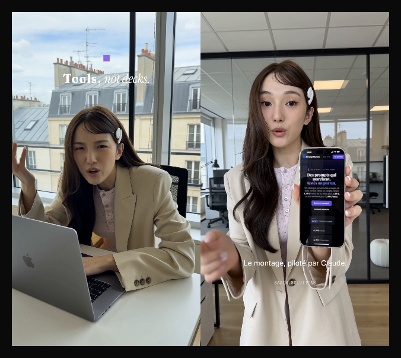

<p align="center">
  
</p>

<h1 align="center">fcp-live</h1>
<p align="center"><b>Claude edits Final Cut Pro. Live. In your brand.</b></p>

<p align="center">
  <a href="https://github.com/AlessandroB1989/fcp-live/blob/main/LICENSE"></a>
  
  
  
  <a href="https://github.com/elliotttate/SpliceKit"></a>
</p>

You generate a clip with Higgsfield, Kling or HeyGen. You say *"make the baair reel: hook 'Tools, not decks.', two lines, CTA"*. Claude imports it into Final Cut Pro, lays out every title in **your** fonts, colours and safe zones, checks the viewer frame by frame, and hands you a timeline that only needs **File › Share**.

No cloud editor. No FCPXML round-trips by hand. No footage leaving the Mac.

## Why this exists

| Approach | What Claude can do | What it can't |
|---|---|---|
| FCPXML round-trip (export → edit XML → import) | structural edits, markers, rough cuts | see the result, act while you edit |
| AppleScript / UI scripting | menus, shortcuts | anything reliable in a non-English UI |
| **SpliceKit in-process bridge (this)** | import, cut, titles, effects, inspector, **viewer capture** | export (on purpose) |

[SpliceKit](https://github.com/elliotttate/SpliceKit) loads a dylib into a re-signed **copy** of Final Cut Pro and exposes ~220 MCP tools. fcp-live is the layer that makes those tools produce **on-brand** video: a brand kit, a frame-accurate FCPXML generator for titles, a Claude Code skill with the operating procedure, and the installer that makes the whole thing reproducible on a clean Mac.

## What you get

- **`install.sh`** — one command: clones SpliceKit, applies the build fixes, patches a copy of FCP, sets up the MCP server, registers it in Claude Code, installs the example brand fonts, links the skill. Idempotent; re-run after an FCP update.
- **`SKILL.md`** — the procedure Claude follows: bridge check, spec → FCPXML → import, cut, titles, mandatory viewer verification, voice-over, captions, handover. Safety rules included (one FCP instance, sandbox library, no export). French version in `docs/SKILL.fr.md`.
- **`scripts/build_fcpxml.py`** — brand-kit-driven FCPXML 1.11 generator. Titles are Basic Title instances with `<text-style>` runs. You write sizes and positions in **frame pixels**; it handles Motion's 2× template space, rational frame timing, and puts simultaneous titles in distinct lanes (FCP silently drops overlaps in one lane).
- **`scripts/skbridge.py`** — 60-line JSON-RPC client for the bridge. Script anything without the MCP layer.
- **`brandkits/baair.json`** — example brand kit: colours in hex + FCP floats, fonts per role (title / signature / body / label), safe zones, motion style.
- **`examples/`** — calibration and demo specs with their viewer captures.
- **`splicekit-patches/`** — fixes to build SpliceKit v3.3.9 from source without the Blackmagic RAW SDK ([upstream PR #87](https://github.com/elliotttate/SpliceKit/pull/87)).

## Quick start

```bash
git clone https://github.com/AlessandroB1989/fcp-live.git
cd fcp-live && bash install.sh
```

Needs macOS 14+, Final Cut Pro 12 (App Store), Xcode command line tools, Python 3.10+, `ffmpeg`, ~12 GB free and, ideally, an Apple Development signing identity. Takes 3–5 minutes; your App Store FCP is never modified.

Then: quit the stock FCP, open `~/Applications/SpliceKit/Final Cut Pro.app`, open a library, accept the macOS permission prompts, restart Claude Code and ask:

> Make a 9:16 reel from `~/Downloads/clip.mp4` with the baair brand kit. Hook: "Tools, not decks." Body: "Le montage, piloté par Claude." Label: BAAIR.SOLUTIONS.

Claude will import, place four titles, capture the viewer at each one, show you the frames, and stop before export.

## How a reel is built

```
brief ──► spec.json ──► build_fcpxml.py ──► FCPXML ──► import_fcpxml (no dialog)
                            ▲                                  │
                   brandkits/<id>.json               open_project · blade
                   fonts · colours · safe zones      seek_to_time · capture_viewer
                                                               │
                                                     Claude reads the PNG,
                                                     adjusts, repeats
```

A spec is small and readable:

```json
{
  "project": "Demo baair", "width": 1080, "height": 1920, "fps": 24, "brandkit": "baair",
  "clips": [ {"path": "~/Downloads/clip.mp4", "in": 0, "duration": 8, "volume_db": -12} ],
  "audio": [ {"path": "~/Movies/ElevenLabs/hook.mp3", "start": 0.3, "role": "dialogue"} ],
  "titles": [
    {"text": "■", "start": 0.3, "duration": 2.9, "role": "body", "size": 56, "color": "purple", "position": "0 760"},
    {"start": 0.3, "duration": 2.9, "size": 84, "color": "ink_paper", "position": "0 620",
     "runs": [ {"text": "Tools, ", "role": "title"}, {"text": "not decks.", "role": "signature"} ]},
    {"text": "Le montage, piloté par Claude.", "start": 3.4, "duration": 3.2, "role": "body", "size": 48, "position": "0 -560"},
    {"text": "BAAIR.SOLUTIONS", "start": 3.4, "duration": 3.2, "role": "label", "size": 30, "color": "grey_body_dark", "position": "0 -680"}
  ]
}
```

That spec (minus the audio line) produced the hero image above, untouched. The audio line connects a voice-over under the storyline and ducks the clip's own sound by 12 dB.

## Bring your own brand

Copy `brandkits/baair.json`, rename, change the colours and the four font roles, install the fonts in `~/Library/Fonts`. Everything else — spec format, lanes, safe zones, verification loop — stays the same. One brand kit per client; one skill.

## Things learned the hard way (so you don't have to)

- Basic Title's Motion space is **2× frame pixels** on FCP 12.3: size 54 renders ~108 px, position "0 300" lands 600 px up.
- The position param key is `9999/999166631/999166633/1/100/101` (Transform › Position). Other keys are silently dropped on import.
- Two connected titles in the **same lane at the same time** import fine and render only one. No warning.
- A macOS permission dialog freezes the bridge: every call returns `attempt to insert nil object`. Click *Allow*, it resumes.
- SpliceKit's `patch_fcp.sh` v2.0.0 could not build v3.3.9 on a clean machine; see `splicekit-patches/` and PR #87.
- SpliceKit ships Sentry crash reporting with `sendDefaultPii`. `install.sh` turns it off before first launch.

## Status and roadmap

Validated 2026-09-03 on FCP 12.3 / macOS 26.5.2 / SpliceKit 3.3.9: internal FCPXML import, brand fonts, mixed-style runs, lanes, positions, viewer verification, connected voice-over with ducking.

- [x] Voice-over round-trip (TTS file → connected lane −1 audio → clip ducked −12 dB)
- [ ] Caption styling from the brand kit (`set_caption_style`)
- [ ] Keyframed text animations (Motion params in FCPXML)
- [ ] 16:9 calibration (YouTube) and a second brand kit
- [ ] Batch: N clips → N reels from one brief

Issues and PRs welcome. If you run a different FCP version, please report the template scale you measure.

## Credits

Built on [SpliceKit](https://github.com/elliotttate/SpliceKit) by Elliott Tate (MIT). Brand kit and workflow by [baair.solutions](https://baair.solutions). Fonts: Fraunces, Instrument Serif, Inter, JetBrains Mono (SIL OFL).

MIT — see LICENSE. Not affiliated with Apple, SpliceKit, or ElevenLabs.
